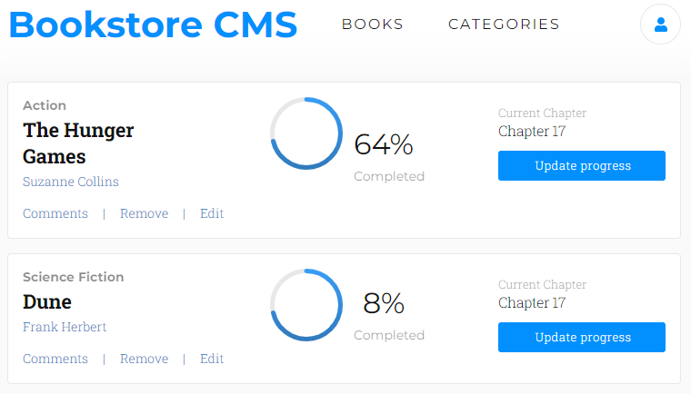

# Bookstore
An online book store application built using react and redux. It allows users to add and remove books in different categories from their collection.

This is my Bookstore project in the Microverse curriculum.

## Built With

- REACT
- SCSS
- JSX
- REACT-ROUTER-DOM

## Live Demo

[Live Demo Link](https://bookstore-library-app.netlify.app/)

## Getting Started

To get a local copy up and running:

1. Clone this repository or download the Zip folder:

**``git clone https://github.com/AbuRayhaan/Bookstore``**

1. Navigate to the location of the folder in your machine:

**``you@your-Pc-name:~$ cd <folder>``**

## Author

👤 **Hammed Adisa**

- Github: [@AbuRayhaan](https://github.com/AbuRayhaan)

- LinkedIn: [Adisa Hammed](https://www.linkedin.com/in/hammed-adisa-mct-ccsp-ctp-b4378372/)

## Contributing

Contributions, issues, and feature requests are welcome!

## Show your support

Give a ⭐ if you like this project and how we manage to build it!

## 📝 License

This project is [MIT](https://github.com/AbuRayhaan/Bookstore/blob/development/LICENSE)
